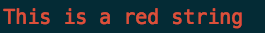

# Retarded log

Create for lazy programmer, help you become a lazier programmer but can also be a good pretty logging system

# Installation
`$ npm install retarded-log`

# Usage

``` javascript
var log = require('retarded-log');

log(); //print a blank line

log('This is a string')
=> This is a string

log.r('This is a red string')
```
=> 

``` javascript

// You want a global log, just 1 line
File1.js

log.setGlobal();

File2.js

log("Hey no more require is needed");

```

#### Basic Color include:

=> **[ blue, red, green, yellow, white ]**

###### Abbreviation :

=> **[ b   , r  , g    , y     , w     ]**

# Frequently logging system

``` javascript

// color are preset
log.err([print-object]) //error
log.inf([print-object]) //info
log.wrn([print-object]) //warning
log.lrt([print-object]) //alert

```
*==> output*


- Notes: Date time and hour of logger will be include for easy debug process


# Image as Ascii

``` javascript

// choose the color that you like
log.[color].img({
  url : "[URL FROM INTERNET]",
  background : "light" or "dark",
  chars: "x_=+" //char desire - optional parameter, prefer leave empty
  size : 100 //Maximum 200
})
```
- Notes: Image will only be downloaded once and write to a file unless setting or different image is requested. This setting is for sufficient loading rather than make request on every run.

# Prettify json as YAML
``` javascript

var obj = {
  test : "test",
  test1 : {
    something : "something"
  },
  test2 : {
    something2 : {
      something3 : "something3"
    }
  }
}

///////////////////////////////////////////////////////////
log(obj);

=> regular print
{ test: 'test',
  test1: { something: 'something' },
  test2: { something2: { something3: 'something3' } } }

////////////////////////////////////////////////////////
log.enablePrettyPrint(); // only enable once
log(obj)

=> pretty print
test : 'test',
test1:
  something: 'something'
test2:
  something2:
    something3: 'something3'

/////////////////////////////////////////////////////////////
log.disbalePrettyPrint(); // to disable pretty print
```

## Authors

- [Lan Nguyen](https://github.com/lan-nguyen91)


#### By the authors

- [Hart Engineering](http://engineering.hart.com/)
